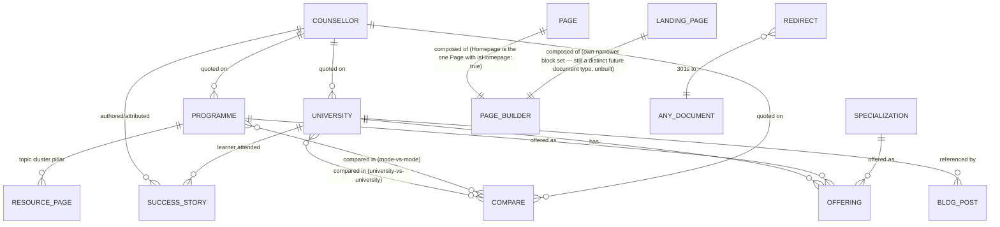

# Content Model & Data Relationships

Full field-level schema for every Sanity document/object type, plus the entity-relationship model and the sitemap reference. This is the most detail-heavy document in the set — it is the direct translation of the HTML mockup teardown and the content-strategy extraction into a buildable schema.

## 1. Entity relationship diagram

## 2. Document types

### University

The core "money page" entity. Fields consolidated from the `university-nmims.html` teardown, cross-checked against `University.csv`.

| Field | Type | Notes |
|---|---|---|
| `name` | string | e.g. "NMIMS" |
| `slug` | slug | new canonical path segment, e.g. `nmims` |
| `legacySlugs` | array of string | e.g. `["nmims-distance-mba"]` — resolved via redirect, see [ROUTING_STRATEGY.md](ROUTING_STRATEGY.md) |
| `logo` | image | |
| `universityType` | string (list) | `Deemed-to-be University` \| `Private University` \| `Private B-School` \| `Aggregator Platform` |
| `positioningStatement` | string | one-liner, e.g. "Best suited for working professionals wanting a recognised brand name" |
| `heroEyebrow`, `heroHeading`, `heroSubhead` | string / text | |
| `trustBadges` | array of reference → `accreditationBody` (or inline `accreditationBadge` objects: UGC-DEB, AICTE, NAAC grade, AIU, WES) | |
| `quickFacts` | object | `{ totalFee: string, duration: string, mode: string, eligibilityShort: string, accreditationShort: string }` — the 5-cell facts strip |
| `fitGuidance` | object | `{ suitsIf: string[], lookElsewhereIf: string[] }` — bullets may contain internal links to competing `university` docs |
| `aboutBody` | array (Portable Text) | rich-text "About the programme" |
| `specializationsOffered` | array of reference → `specialization` | replaces a freeform bullet list with real relations, enabling the Specialization page's "universities offering this" query |
| `feeStructure` | array of object `{ label, value }` | e.g. general-track fee, premium-track fee, EMI terms, application fee |
| `eligibility` | object | `{ qualification, workExperience, entranceRequirement, ageLimit }` |
| `applicationTimeline` | array of object `{ period, milestone }` | supports 2 intake cycles/year |
| `accreditationDetail` | array of object `{ label, value, sourceUrl }` | `sourceUrl` makes every accreditation claim link to source, per EEAT requirement |
| `counsellorNote` | object `{ quote: text, counsellor: reference → counsellor }` | |
| `compareWith` | array of reference → `compare` (or auto-derived — see note) | powers "Compare with" teaser cards |
| `faqs` | array of `faq` object | 5-10 items enforced by Studio validation |
| `leadForm` | `leadFormConfig` object | fields default to Name/Phone/Specialisation-interest per [FORMS_ARCHITECTURE.md](FORMS_ARCHITECTURE.md) |
| `seo` | `seo` object | |
| `csvLegacyFeeRaw`, `csvLegacyDurationRaw`, `csvLegacyEligibilityRaw` | string (internal, hidden field group) | **migration-only** staging fields to hold the messy `University.csv` values (`"4,00,000/-"`, uniform placeholder duration/eligibility text) until an editor confirms/replaces them with real per-university data — not rendered on the front end; see field notes below |

**Field notes (University):** `University.csv`'s `Fees` column is not directly usable as a numeric field (mixed formats, one range value, trailing `/-`) and its `Duration`/`Eligibility` columns are uniform placeholder text across all 30 rows. The model above keeps the human-facing `feeStructure`/`eligibility`/`quickFacts` fields as structured, editor-authored content, and imports the raw CSV values into hidden `csvLegacy*` fields purely so no data is silently discarded during migration — an editor reconciles and clears them before a University document is published. This directly implements assumption/open-item MI-2 in [REQUIREMENTS_ANALYSIS.md § 15](REQUIREMENTS_ANALYSIS.md#15-missing-information--open-items-for-stakeholder-sign-off).

### Programme (Mode)

One document per MBA mode — exactly 4 published documents (Distance, Online, Executive, Correspondence), plus the special `iim-alternatives` explainer as a child page of Executive.

| Field | Type | Notes |
|---|---|---|
| `modeName` | string (list, one of the 4) | |
| `slug` | slug | `distance-mba`, `online-mba`, `executive-mba`, `correspondence-mba` |
| `heroEyebrow` (fixed: "Programme Mode"), `heroHeading`, `heroSubhead` | | |
| `definitiveAnswer` | Portable Text | "What is a {Mode} MBA?" — should contain a `calloutBlock` variant flagged for AEO extraction (the "one-line definition" pattern found in the resource-page mockup) |
| `modeComparisonTable` | array of object `{ mode: reference → programme, structure, feeRange, bestFor }` | powers the 4-row mode-comparison table; self-referencing so all 4 mode docs stay consistent from one edited table |
| `fitGuidance` | object `{ suitsIf: string[], lookElsewhereIf: string[] }` | |
| `feeRange`, `duration` | string | |
| `counsellorNote` | object | |
| `faqs` | array of `faq` | |
| `leadForm` | `leadFormConfig` | default fields: Name/Phone/Specialisation |
| `isIimAlternativesExplainer` | boolean | flags the one special child page under Executive MBA, per content-strategy §1.2's IIM handling requirement |
| `seo` | `seo` | |

Universities/offerings for a given mode are **not** stored on the Programme document — they're derived at query time from `offering` documents referencing this mode (see Offering below), so the "Top Universities" card grid always reflects current Offering data rather than a manually duplicated list.

### Specialization

| Field | Type | Notes |
|---|---|---|
| `name`, `slug` | | 14 total per the sitemap (Marketing, Finance, HR, Operations, IT & Systems, Banking & Finance, Digital Marketing, Business Analytics, Data Science & AI, Supply Chain, Healthcare, International Business, Project Management, General Management) |
| `heroHeading`, `heroSubhead` | | |
| `curriculumTopics` | array of object `{ name, description }` | "What you'll learn" — 7 items in the Marketing mockup, count varies by specialization |
| `fitGuidance` | object | |
| `careerPaths` | array of object `{ role, experienceNeeded, salaryBand }` | drives the Career Paths / salary table |
| `recruiterCategories` | array of object `{ categoryLabel, companies: string[] }` | |
| `decisionSteps` | array of object `{ number, question, answer }` | "How to choose" numbered steps — validate count matches the heading's stated number (mockup had a "four questions"/3-steps mismatch to avoid repeating) |
| `faqs` | array of `faq` | optional — confirmed not always present |
| `leadForm` | `leadFormConfig` | default field: Name/Phone/"Target role" — **options list is itself a content field**, since target-role options are specialization-specific (Marketing's options differ from Finance's) |
| `seo` | `seo` | |

Universities offering a specialization are derived from `offering` documents, rendered via either `UniversityCardGrid` or `UniversityCompareTable` per [COMPONENT_ARCHITECTURE.md](COMPONENT_ARCHITECTURE.md) — same query, two presentational choices, resolved by a `displayStyle` field on the Specialization document (`'cards' | 'table'`) so editors can choose per page.

### Offering {#offering}

The normalized join entity implementing FR-4 — confirmed necessary because the same university/mode/specialization fee-and-depth data appeared independently (and slightly inconsistently) on both the Programme and Specialization mockups.

| Field | Type | Notes |
|---|---|---|
| `university` | reference → `university` | required |
| `programme` | reference → `programme` | required |
| `specialization` | reference → `specialization` | optional (a university can offer a mode generally, without every specialization being modeled individually) |
| `fee` | string (display) + `feeMin`/`feeMax` number (sort/filter) | mirrors the University-level fee-normalization approach |
| `duration` | string | |
| `depthNote` / `bestFor` | string | e.g. "8+ marketing electives," "Strong digital focus" |
| `isFeaturedOnHomepage` | boolean | lets editors control the homepage's 8-card featured set without a separate duplicated list |

This document type is mostly **editorially invisible** — it's managed via a reference-list UI embedded in the University document's Studio view ("Add an offering") rather than through its own top-level desk list, though the desk structure still exposes it directly for bulk edits (see [SANITY_CMS_ARCHITECTURE.md § 3](SANITY_CMS_ARCHITECTURE.md#3-studio-structure-desk-organization)).

### Compare

| Field | Type | Notes |
|---|---|---|
| `comparisonType` | string (list) | `university-vs-university` \| `mode-vs-mode` |
| `entityA`, `entityB` | reference → `university` OR `programme` (type depends on `comparisonType`) | |
| `slug` | slug | alphabetical convention enforced by a Studio custom input component that auto-generates `a-vs-b` from `entityA`/`entityB` names in alphabetical order |
| `oneLineVerdict` | text | |
| `comparisonRows` | array of object `{ label, valueA, valueB }` | the 11-row neutral fact table (fee, duration, mode, specialisations count, strongest streams, accreditation, university type, brand strength, live-session timing, EMI, eligibility) |
| `whereAWins`, `whereBWins` | array of object `{ boldLeadIn, description }` | |
| `chooseAIf`, `chooseBIf` | array of string | |
| `honestTradeOff` | Portable Text | |
| `counsellorNote` | object | |
| `relatedComparisons` | array of reference → `compare` | "Compare others" teasers |
| `faqs` | array of `faq` | |
| `leadForm` | `leadFormConfig` | default: Name/Phone/"Leaning toward A / B / Unsure" — options derived from `entityA`/`entityB` names at render time, not hand-typed |
| `seo` | `seo` | |

### Blog Post

| Field | Type | Notes |
|---|---|---|
| `title`, `slug` | | |
| `category` | string (list) | career-advice, how-to-apply, university-news, industry-trends, working-professional |
| `author` | reference → `counsellor` (reused as the author-credential type — "not DMC Team," per EEAT requirement) | |
| `publishedAt`, `updatedAt` | datetime | single source for all "last updated" displays, and for `Article` JSON-LD `datePublished`/`dateModified` — fixes the mockups' 3-separate-places-asserting-the-same-date drift |
| `body` | Portable Text with custom blocks (`calloutBlock`, `dataTableBlock`, `pullQuoteBlock`, `inlineLeadCtaBlock`) | |
| `relatedUniversities` | array of reference → `university` | |
| `faqs` | array of `faq` | optional |
| `seo` | `seo` | |

### Resource Page (Pillar/Guide)

Same shape as Blog Post plus: `readTimeMinutes` (number), `tocOverride` (optional manual TOC — default is auto-generated from body H2/H3, per the fix noted in requirements), `embeddedTools` (array of `'emiCalculator' | 'eligibilityChecker'` — flags which smart-tool components can be dropped inline via a dedicated Portable Text block type).

### Campaign Landing Page

| Field | Type | Notes |
|---|---|---|
| `title`, `slug` (under `/lp/`) | | |
| `campaignSource` | string | UTM/ad-set label for internal tracking, not shown to visitors |
| `pageBuilder` | array (restricted block set) | see [PAGE_BUILDER_ARCHITECTURE.md § 5](PAGE_BUILDER_ARCHITECTURE.md#5-campaign-landing-page-specifics) |
| `leadForm` | `leadFormConfig` | default: 1-2 fields, phone-first |
| `seo` | `seo` (typically `noindex: true`, since paid-only) | |

### Counsellor

| Field | Type | Notes |
|---|---|---|
| `name`, `slug`, `photo` | | |
| `jobTitle` | string | maps directly to `Person.jobTitle` schema |
| `yearsExperience` | number | |
| `location` | string | |
| `knowsAbout` | array of string | maps to `Person.knowsAbout` |
| `bio` | Portable Text | |

### Success Story

| Field | Type | Notes |
|---|---|---|
| `learnerName`, `learnerPhoto` | | consent-to-publish must be confirmed editorially before publish (governance note, not a schema field) |
| `university` | reference → `university` | |
| `programme` | reference → `programme` | |
| `outcomeNarrative` | Portable Text | |
| `beforeRole`, `afterRole` | string | |

### Page

**Supersedes the earlier "Homepage (singleton)" model** — see [PAGE_BUILDER_ARCHITECTURE.md](PAGE_BUILDER_ARCHITECTURE.md) for the full rationale. `Page` is the one generic, reusable document type behind every page-builder-driven page: `{ title, slug, isHomepage: boolean, sections: array, seo: seo }`. The Homepage is simply the one `Page` document with `isHomepage: true` (rendered at `/`); every future Landing/Compare/Resources page is another `Page` document (rendered at `/{slug}`) — same schema, same route, same `SectionRenderer`, no per-page-type document type. `slug` and `isHomepage` each carry a uniqueness validation rule (custom `Rule.custom` querying the dataset) so exactly one `Page` can be the Homepage and no two `Page`s can collide on a slug.

Fixed-template document types (University, Programme, Specialization, Compare) are unaffected — they remain their own document types per [PAGE_BUILDER_ARCHITECTURE.md § 1](PAGE_BUILDER_ARCHITECTURE.md#1-scope-where-the-page-builder-applies), not `Page` documents.

### Site Settings (singleton)

The single global configuration document — absorbs the former separate `Navigation` singleton, so there is deliberately only one global-config document, not two: `{ siteName, tagline, logo, favicon, chatWelcomeMessage, headerProgrammesLinks[], headerUniversitiesLinks[] (top 5 + "view all" target), footerColumns: [{title, links[]}], phone, whatsappNumber, email, legalEntityName, cin, gst, registeredOfficeAddress, socialLinks[], defaultSeo: seo, organizationSchema, theme: { primaryColorOverride?, accentColorOverride? } }`. Powers `Header`/`Footer` per [LAYOUT_ARCHITECTURE.md](LAYOUT_ARCHITECTURE.md), `defaultSeo` is the fallback when a `Page` doesn't set its own SEO, and `theme` is an optional hex-color override on top of the code-level brand tokens — all editable without a deploy.

### Redirect

`{ fromPath (string, unique, indexed), toPath (string) OR toDocument (reference, resolved to its live path at render time), statusCode: 301 (fixed), note (internal-only, e.g. "REDIRECT-AND-CONSOLIDATE: templated SEO fluff") }` — one document per row of the content strategy's Appendix A migration map. See [ROUTING_STRATEGY.md](ROUTING_STRATEGY.md) for resolution mechanics.

## 3. Shared object types

| Object | Shape |
|---|---|
| `seo` | `{ title, description, ogImage, canonicalUrl?, noindex? }` |
| `faq` | `{ question, answer }` |
| `leadFormConfig` | `{ title, subtitle, fields: ('name'\|'phone'\|'email'\|'city'\|'select')[], selectOptions?: string[], selectLabel?: string, submitLabel, footerNote }` |
| `cta` | `{ label, internalLink? (reference, weak), externalHref?, style: 'primary'\|'secondary'\|'ghost' }` |
| `accreditationBadge` | `{ label, sourceUrl? }` |
| `navLink` | `{ label, href }` — reused across Site Settings' header/footer link arrays |

## 4. Sitemap reference {#sitemap-reference}

Authoritative URL list (superseding `sitemap.xlsx`, whose Compare/Resources columns are blank — see [REQUIREMENTS_ANALYSIS.md § 15](REQUIREMENTS_ANALYSIS.md#15-missing-information--open-items-for-stakeholder-sign-off)), consolidated from the content-strategy document:

| Section | URL pattern | Funnel |
|---|---|---|
| Home | `/` | TOFU |
| How It Works | `/how-it-works/` | TOFU |
| Programmes overview | `/programmes/` | TOFU |
| Programme mode hub | `/programmes/{distance-mba\|online-mba\|executive-mba\|correspondence-mba}/` | TOFU |
| IIM alternatives | `/programmes/executive-mba/iim-alternatives/` | TOFU |
| Universities directory | `/universities/` | MOFU |
| University profile | `/universities/{slug}/` (+ legacy flat URLs preserved via redirect) | MOFU |
| Specializations directory | `/specializations/` | MOFU |
| Specialization | `/specializations/{slug}/` (14 total) | MOFU |
| Compare directory | `/compare/` | MOFU |
| Compare page | `/compare/{a}-vs-{b}/` (alphabetical slug order; 12-15 target pages) | MOFU |
| Resources hub | `/resources/` | TOFU/MOFU |
| Resource/pillar page | `/resources/{slug}/` (8 total, incl. fee-emi-calculator, eligibility-checker) | TOFU |
| Counsellors | `/counsellors/`, `/counsellors/{slug}/` | Trust/EEAT |
| Success stories | `/success-stories/`, `/success-stories/{slug}/` | MOFU/BOFU |
| Blog | `/blog/`, `/blog/{category}/{slug}/` | TOFU |
| Utility | `/about/`, `/contact/`, `/brochure/`, `/privacy-policy/`, `/terms-and-conditions/`, `/thank-you/` | mixed |
| Campaign LP | `/lp/{slug}/` (27 existing, migrated with 301s from old root-level URLs) | BOFU |

Private-university target directory (priority tiers, for build sequencing — see [PROJECT_STATUS.md](PROJECT_STATUS.md)):

1. **Deemed-to-be Universities (highest priority):** NMIMS, Symbiosis (SCDL/SSODL), MAHE/Online Manipal, Amity, Jain, ICFAI, VIT, BITS Pilani WILP, DY Patil, GITAM, SP Jain
2. **Private Universities:** LPU, Chandigarh University, Manipal University Jaipur, Bennett, SGVU, O.P. Jindal Global, Sharda, KL University
3. **Private B-Schools:** IMT Ghaziabad CDL, Welingkar/WeSchool, XLRI VIL, MDI Gurgaon, Great Lakes
4. **Aggregators:** Online Manipal, upGrad, Hero Vired, Eruditus
5. **Flagged for verification before publish:** Sikkim Manipal University (UGC-DEB status historically complicated — do not publish until confirmed)

Full 72-URL legacy migration map (KEEP / REWRITE / REDIRECT-AND-CONSOLIDATE / KEEP-AND-UPDATE categories) is preserved as-is in the source content-strategy document and becomes the literal seed data for the `redirect` document collection — it is not reproduced line-by-line here to avoid a second, driftable copy; see [ROUTING_STRATEGY.md](ROUTING_STRATEGY.md) for how it's operationalized.
