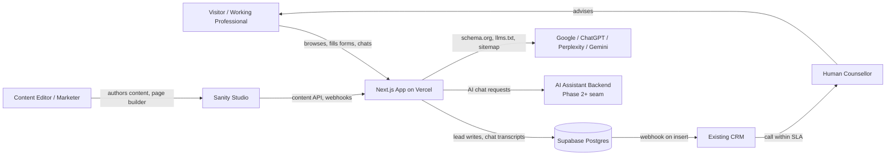
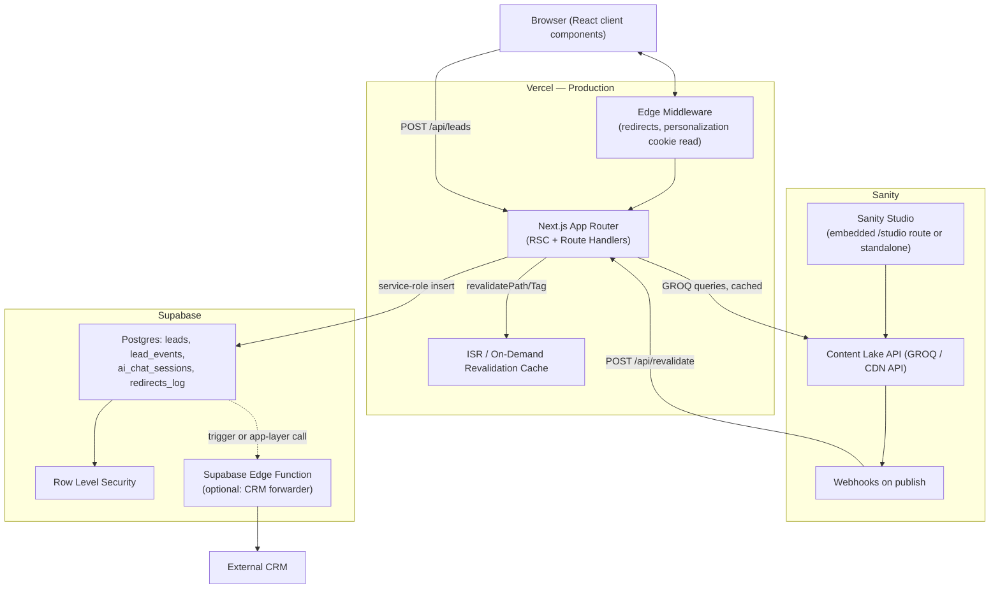

# Overall System Architecture

## 1. System context

**Three systems of record, one each, no overlap:**

| System | Owns | Never owns |
|---|---|---|
| **Sanity CMS** | All marketing/editorial content — pages, universities, programmes, specializations, compare pages, blog, FAQs, SEO fields, navigation, redirects, site settings | Lead data, PII, transcripts |
| **Supabase** | Form submissions, lead scoring state, AI chat transcripts, redirect/analytics event logs (if enabled) | Any content a marketer edits |
| **Vercel** | Build, deploy, edge/CDN delivery, ISR revalidation, environment config | Persistent data of any kind |

This separation is the single most important architectural decision in the system: it means a content edit **never** requires a code deploy, and a code deploy **never** touches lead data. See [SANITY_CMS_ARCHITECTURE.md](SANITY_CMS_ARCHITECTURE.md) and [SUPABASE_ARCHITECTURE.md](SUPABASE_ARCHITECTURE.md).

## 2. Container view

## 3. Request flow — a typical page render

1. Visitor requests `/universities/nmims/`.
2. **Edge Middleware** checks the redirect table (sourced from Sanity `redirect` documents, cached at build/revalidation time) — if the path matches a legacy URL, issue a 301 immediately, no further work. See [ROUTING_STRATEGY.md](ROUTING_STRATEGY.md).
3. If no redirect, the App Router resolves the route to `app/(site)/universities/[slug]/page.tsx`.
4. The page's server component runs a GROQ query against Sanity's CDN API for the `university` document matching `slug`, plus its referenced `offering`, `faq`, and `seo` data — fetched with Next.js `fetch` caching tagged for that document's `_id`.
5. React Server Components render the page server-side; only interactive leaves (`LeadForm`, `ChatWidget`, `FAQAccordion`, `EMICalcWidget`) are Client Components, hydrated individually.
6. Response is cached at the edge (ISR); subsequent visitors are served from cache until the next revalidation event.
7. On form submission, a Client Component posts to a Next.js Route Handler (`/api/leads`), which validates, scores, writes to Supabase with the service-role key (never exposed to the browser), and fires the CRM webhook.
8. On content publish in Sanity, a webhook calls `/api/revalidate` with the changed document's `_id`/`_type`, and Next.js revalidates exactly the affected paths via tag-based `revalidateTag`.

## 4. Integration architecture

| Integration | Direction | Mechanism | Doc |
|---|---|---|---|
| Sanity → Next.js | pull (queries) | GROQ via `@sanity/client`, CDN-cached | [SANITY_CMS_ARCHITECTURE.md](SANITY_CMS_ARCHITECTURE.md) |
| Sanity → Next.js | push (invalidation) | Webhook → `/api/revalidate` → `revalidateTag` | [DEPLOYMENT_STRATEGY.md](DEPLOYMENT_STRATEGY.md) |
| Next.js → Supabase | push (writes) | Route Handler with service-role key, server-side only | [SUPABASE_ARCHITECTURE.md](SUPABASE_ARCHITECTURE.md) |
| Supabase/Next.js → CRM | push (webhook) | Outbound POST on lead insert, retried with backoff | [SUPABASE_ARCHITECTURE.md](SUPABASE_ARCHITECTURE.md), [FORMS_ARCHITECTURE.md](FORMS_ARCHITECTURE.md) |
| Next.js → AI backend | request/response | Server-proxied chat endpoint (`/api/chat`), backend swappable behind this seam | [AI_PERSONALIZATION_ARCHITECTURE.md](AI_PERSONALIZATION_ARCHITECTURE.md) |
| Next.js → Search/AI engines | pull (crawl) | `sitemap.xml`, `robots.txt`, `llms.txt`, schema.org JSON-LD | [SEO_STRATEGY.md](SEO_STRATEGY.md) |

## 5. Environments

| Environment | Sanity dataset | Supabase project | Vercel target | Purpose |
|---|---|---|---|---|
| Local | `development` | local/dev project or branch DB | — (`next dev`) | Day-to-day development |
| Preview | `staging` | staging project | Vercel Preview Deployments (per-PR) | Stakeholder review, editor content QA |
| Production | `production` | production project | Vercel Production | Live site |

Full promotion flow in [DEPLOYMENT_STRATEGY.md](DEPLOYMENT_STRATEGY.md) and branch policy in [GIT_WORKFLOW.md](GIT_WORKFLOW.md).

## 6. Key architectural decisions (ADR summary)

| # | Decision | Rationale | Alternative considered |
|---|---|---|---|
| ADR-1 | Content lives exclusively in Sanity; Supabase never stores editorial content | Keeps one source of truth per concern; avoids drift between "what marketers edit" and "what renders" | Storing university directory in Supabase for relational queries — rejected: loses Sanity's editorial workflow/preview for that content |
| ADR-2 | Rendering strategy is SSG/ISR-first, not client-rendered SPA | Meets Core Web Vitals targets (NFR-1..5); most content changes infrequently | Full SSR on every request — rejected: unnecessary origin load for content that changes hours/days apart |
| ADR-3 | Page builder pattern for Homepage and Campaign LPs, fixed templates for entity pages (University/Programme/Specialization/Compare) | Entity pages need consistent, comparable structure (for both users and AEO extraction); only marketing-led pages need arbitrary section ordering | Page-builder everywhere — rejected: would let editors accidentally break the structured-data guarantees FR-15 depends on |
| ADR-4 | AI chat widget calls a server-side proxy route, never a client-side third-party SDK key | Keeps any future LLM API key server-only; allows swapping backend without a client release | Direct client → LLM vendor call — rejected on security and flexibility grounds |
| ADR-5 | Redirects resolved in Edge Middleware from a Sanity-sourced table, not hardcoded `next.config.js` redirects | ~70+ legacy URLs need editor-manageable redirects without a redeploy per change | Static `next.config.js` redirects array — rejected: requires a deploy for every redirect edit |
